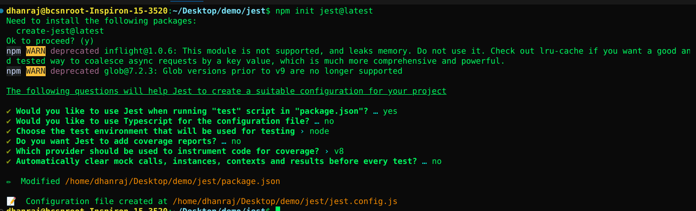

## Jest Compenents
```
                                    JEST                                       
          ___________________________|_____________________________                
         |           |          |        |          |              |
    Globals   Jest Objects    Expect  Jest Mock  Jest Cli   Jest Configure

```

### &nbsp;&nbsp;&nbsp;&nbsp;&nbsp;&nbsp;&nbsp;&nbsp;&nbsp;&nbsp;&nbsp;&nbsp;|| &nbsp;&nbsp;[Globals](./globals.md) &nbsp;&nbsp; ||  &nbsp;&nbsp;[EslintConfig](./eslintConfig.md) &nbsp;&nbsp;|| &nbsp;&nbsp;[Expect](./matchers.md)&nbsp;&nbsp;||&nbsp;&nbsp;[Mocks](./mock.md)&nbsp;&nbsp;||&nbsp;&nbsp;[Jest Objects](./jestObjects.md)&nbsp;&nbsp;||&nbsp;&nbsp;[Jest Cli](./jestCli.md)&nbsp;&nbsp;||&nbsp;&nbsp;[Jest Configure](./jest.config.md) &nbsp;&nbsp;&nbsp;&nbsp;||

# Jest: is a delightful JavaScript Testing Framework with a focus on simplicity.

### Installation
``` bash
npm i -D jest
```
### Configuration
``` bash
 npm init jest@latest
```
### Check all the initial setup prompts


## [jest.config.js](jest.config.md) &#128072;
```javascript
/** @type {import('jest').Config} */
const config = {
    // You can unComments the feature that you want in your project and also customize according to your need 
}
module.exports=config
```
 * For a detailed explanation regarding each configuration property, visit: <br/>
  https://jestjs.io/docs/configuration
 
------------------------------------------------------------------------------------
* All imported modules in your tests should be mocked automatically
  ```bash 
  automock: false,
  ```
## Configure Jest With eslint
[```.eslintrc.json``` File#](./eslintrc.json) &#128072;

Jest can be used with ESLint without any further configuration as long as you import the [Jest global helpers](https://jestjs.io/docs/api) `(describe, it, etc.)` from `@jest/globals` before using them in your test file. This is necessary to avoid no-undef errors from ESLint, which doesn't know about the Jest globals.

If you'd like to avoid these imports, you can configure your [ESLint environment](https://eslint.org/docs/latest/use/configure/language-options#specifying-environments) to support these globals by adding the jest environment:
```json
{
  "overrides": [
    {
      "files": ["tests/**/*"],
      "env": {
        "jest": true
      }
    }
  ]
}
```
Or use [eslint-plugin-jest](https://github.com/jest-community/eslint-plugin-jest), which has a similar effect:
```json
{
  "overrides": [
    {
      "files": ["tests/**/*"],
      "plugins": ["jest"],
      "env": {
        "jest/globals": true
      }
    }
  ]
}
```
### [Go For eslint more Configurations](./eslintConfig.md) &#128072;

## Jest Compenents
```
                                    JEST                                       
          ___________________________|_____________________________                
         |           |          |        |          |              |
    Globals   Jest Objects    Expect  Jest Mock  Jest Cli   Jest Configure

```
## [Except](./matchers.md) &#128072;


### Expect in Jest

The `expect` function in Jest is used to access a set of methods called "matchers" that let you test values in various ways. When you're writing tests, you'll often need to check that values meet certain conditions. `expect` gives you access to a number of "matchers" that let you validate different things.

#### Basic Usage

```javascript
test('two plus two is four', () => {
  expect(2 + 2).toBe(4);
});
```

In this example, `.toBe(4)` is the matcher. It checks that the expected value is 4.

#### To Equal

Use `.toEqual` to compare recursively all properties of object instances (also known as "deep" equality).

```javascript
test('object assignment', () => {
  const data = {one: 1};
  data['two'] = 2;
  expect(data).toEqual({one: 1, two: 2});
});
```

#### Not

You can use `not` to test the opposite of a matcher.

```javascript
test('adding positive numbers is not zero', () => {
  for (let a = 1; a < 10; a++) {
    for (let b = 1; b < 10; b++) {
      expect(a + b).not.toBe(0);
    }
  }
});
```

#### Truthiness

In tests, you sometimes need to distinguish between `undefined`, `null`, and `false`, but you sometimes do not want to treat these differently. Jest contains helpers that let you be explicit about what you want.

- `.toBeNull()` matches only `null`
- `.toBeUndefined()` matches only `undefined`
- `.toBeDefined()` is the opposite of `.toBeUndefined()`
- `.toBeTruthy()` matches anything that an `if` statement treats as true
- `.toBeFalsy()` matches anything that an `if` statement treats as false

```javascript
test('null', () => {
  const n = null;
  expect(n).toBeNull();
  expect(n).toBeDefined();
  expect(n).not.toBeUndefined();
  expect(n).not.toBeTruthy();
  expect(n).toBeFalsy();
});
```

#### Numbers

There are several matchers for checking numbers against different conditions.

```javascript
test('two plus two', () => {
  const value = 2 + 2;
  expect(value).toBeGreaterThan(3);
  expect(value).toBeLessThan(5);
  expect(value).toBe(4);
  expect(value).toEqual(4);
});
```

These examples illustrate the flexibility and power of Jest's `expect` function for writing tests in JavaScript.
## [Go For More Matchers](./matchers.md) &#128072;


# [Globals](./globals.md) &#128072;

Jest provides several global variables and functions that are available anywhere in your test files. These globals help in creating, organizing, and executing tests efficiently. Below are three key globals provided by Jest, along with examples of their usage.

### 1. `describe`

The `describe` function is used to group together several related tests. This is particularly useful for organizing tests that cover a specific module or component.

```javascript
describe('Array operations', () => {
  test('should add elements to an array', () => {
    const arr = [];
    arr.push(1);
    expect(arr).toHaveLength(1);
  });

  test('should remove elements from an array', () => {
    const arr = [1, 2, 3];
    arr.pop();
    expect(arr).toHaveLength(2);
  });
});
```

### 2. `test`

The `test` function is used to define a single test. It takes a name and a function that contains the test's code. The `test` function is an alias for `it`, so they can be used interchangeably.

```javascript
test('two plus two equals four', () => {
  expect(2 + 2).toBe(4);
});

it('array contains the element', () => {
  const arr = ['foo', 'bar'];
  expect(arr).toContain('foo');
});
```

### 3. `expect`

The `expect` function is used to assert different conditions within a test. Jest provides a rich set of matchers that you can use with `expect` to test values in different ways.

```javascript
test('object assignment', () => {
  const obj = {};
  obj['key'] = 'value';
  expect(obj).toEqual({key: 'value'});
});

test('null', () => {
  const n = null;
  expect(n).toBeNull();
  expect(n).toBeDefined();
  expect(n).not.toBeUndefined();
  expect(n).not.toBeTruthy();
  expect(n).toBeFalsy();
});

test('zero', () => {
  const z = 0;
  expect(z).not.toBeNull();
  expect(z).toBeDefined();
  expect(z).not.toBeUndefined();
  expect(z).not.toBeTruthy();
  expect(z).toBeFalsy();
});
```

These examples demonstrate how Jest's global functions and variables can be used to write descriptive and comprehensive tests for JavaScript code.
## [Go For More Globals](./globals.md) &#128072;

## [Mocks](./mock.md) &#128072;

### Mock Functions in Jest

Mock functions in Jest simulate real functions for testing, helping you isolate and verify specific parts of your code.

#### Example:

**Real Function:**

```javascript
// userService.js
export const fetchUserData = async (userId) => {
  const response = await fetch(`/api/users/${userId}`);
  return await response.json();
};
```

**Function to Test:**

```javascript
// userProcessor.js
const { fetchUserData } = require('./userService');

export const processUserData = async (userId) => {
  const userData = await fetchUserData(userId);
  return `User's name is ${userData.name}`;
};
```

**Test with Mock:**

```javascript
// userProcessor.test.js
const { processUserData } =require('./userProcessor');
const { fetchUserData } =require('./userService');

// Mock the fetchUserData function
jest.mock('./userService');

describe('processUserData', () => {
  it('should process user data correctly', async () => {
    fetchUserData.mockResolvedValue({ name: 'John Doe' });

    const result = await processUserData(1);

    expect(fetchUserData).toHaveBeenCalledWith(1);
    expect(result).toBe("User's name is John Doe");
  });
});
```

### Mocks provides
- **Isolation**: Test units independently.
- **Control**: Define mock return values.
- **Verification**: Check function calls and arguments.

# [Jest Objects For More Info](./jestObjects.md) &#128072;

# [JEST CLI FLAGS ]('./jestCli.md) &#128072;